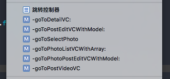

# 控制器

###命名
1. 前缀BB + 功能名称 + Controller
   * BBLoginController -> UIViewConroller (BB + Login + Conroller)
   * BBBuyWebController -> 非买不可网页控制器
   * BBTabController -> tabbar控制器
   * BBNavController -> nav控制器
   
2. 如果是基类,则加上前缀换成BBBase, 功能看需要添加
   * BBBaseWebConroller -> web控制器基类
   * BBBaseTableController -> 列表基类
   * BBBaseCollectionController -> 集合流基类

3. 如果功能名太长，可取单词首字母
  * BBPhotoGalleryListController -> BBPGListController  -> 小影记列表控制器

###mark注释
1. 不要乱注释，每个功能注释一次，只会造成混乱

###跳转控制器
1. 跳转控制器需要单独抽离方法，然后用mark括起来
2. 全部以goTo。。。VC命名

