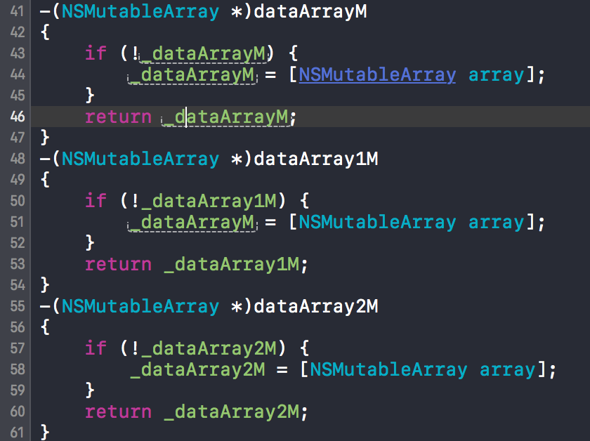
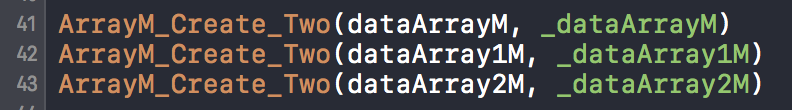

# 数组
###懒加载
    多个数组，有时创建用错了属性名，建议使用宏来懒加载数组，快捷安全
    
1. 宏定义
```objc
/* 
快捷创建NSMutableArray
用法一 ：在get方法里面直接使用宏ArrayM_Create
-(NSMutableArray *)array
{ 
        ArrayM_Create(_array);
}*/
#define ArrayM_Create(A)                       if (!A) {\
A = [NSMutableArray array];\
}\
return A;
/*
 用法二：传两个参数，一个为get方法名，一个为下划线变量名
 注意：这种方法调用时建议先敲中括号[],然后在中括号敲方法
 ArrayM_Create_Two(array1,_array1);
 */
#define ArrayM_Create_Two(A,B)                        - (NSMutableArray *)A\
{\
ArrayM_Create(B)\
}
```
2. 创建
```objc
// 用法一
-(NSMutableArray *)dataArray
{
        ArrayM_Create(_dataArray);
}
// 用法二
ArrayM_Create_Two(dataArray, _dataArray)
```
3. 没有对比就没有伤害
 
 
 
###