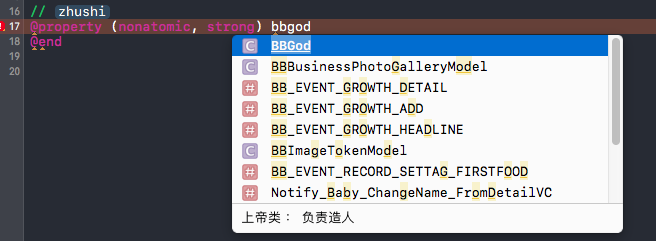
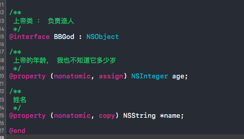

# 注释

###文档注释，有提示，可提高阅读效率
    Xcode 默认文档注释快捷键为 ： command + shift + /
    
1. 【强制】类 ：直接在类名使用注释
```objc
/**
 上帝类 ： 负责造人
 */
@interface BBGod : NSObject
@end
```
效果图 ： 


2. 【强制】.h文件里属性
3. 


3. 【强制】.h文件里方法 (注意，-和void要有空格，这里格式不支持)
```objc
/**
 创建人
 @param name 人名
 */
-(void)createPerpleWithName:(NSString *)name;
```

###快捷注释 : //
    Xcode 默认快捷键为 ： command + /
    
1. 【强制】.m 文件中的属性
```objc
// 姓名
@property (nonatomic, copy) NSString *name;
```
2. 【强制】.m 文件中的方法
```objc
// 说你好
-(void)sayHello
{
      // 打印你好 --> 单行注释针对小功能注释
      NSString *name = self.name; // 要打印的姓名 --> 句尾注释针对变量解释
      NSLog(@"你好！%@", name);
}
```

###类创建 ：【强制】所有的类都必须添加创建者和创建日期。
```objc
//
//  BBGod.h
//  ###（项目名）
//
//  Created by huangkaizhan on 2017/5/28.
//  Copyright © 2017年 mama.cn. All rights reserved.
//

#import <Foundation/Foundation.h>


/**
 上帝类 ： 负责造人
 */
@interface BBGod : NSObject
```

###枚举 ：所有的枚举类型字段必须要有注释，说明每个数据项的用途。
```objc
// 性别
typedef enum {
    SexTypeUnknow,  // 未知
    SexTypeMan,     // 男人
    SexTypeWoman,   // 女人
}SexType_bb;
```

###标记注释
1. mark有助于快速查询，个人觉得按功能分，不需要每个方法都分，没必要的也可不分
```objc
// 标准格式， mark后空格-空格注释
#pragma mark - 这是一个注释
```
效果图 ： 